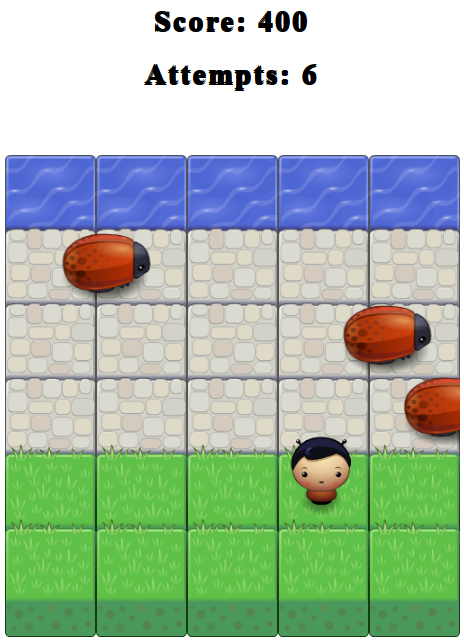

# Classic Arcade Game Project

The Classic Arcade Game Project is the 4th project of the Udacity Front End Nanodegree Progam. It is a complete browser-based game designed using the object oriented knowledge aquired throughout the course.

In this game you have a Player and Enemies (Bugs). The goal of the player is to reach the water, without colliding into any one of the enemies. The player can move left, right, up and down. The enemies move in varying speeds on the paved block portion of the scene. Once a the player collides with an enemy, the game is reset and the player moves back to the start square. Once the player reaches the water the game is won.

## Instructions

1. Open the [Game](https://avnikolaou.github.io/Classic-Arcade-Game-Clone/) into your browser.
1. Use the arrow keys and try to reach the watter without colliding into the enemies.
